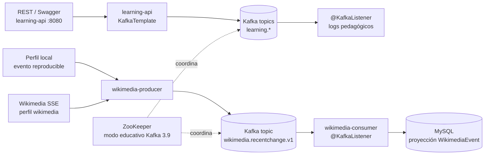

# Spring Boot + Kafka Roadmap Course — Backend

## Qué es este proyecto

Es el laboratorio backend del curso práctico y progresivo en español. No es una aplicación de negocio: cada módulo existe para mostrar, con código comentado, qué sucede cuando Spring Boot publica o consume un evento Kafka.

El recorrido empieza con una API REST que envía texto y JSON; continúa con dos microservicios desacoplados (Wikimedia → Kafka → MySQL); y termina con ejercicios aislados de idempotencia, transacciones, compactación y Kafka Streams. El código explica el concepto, el motivo de la configuración y lo que debés observar en logs o Kafka UI.

## Curso web complementario

El material didáctico —las **22 lecciones**, diagramas, glosario técnico y simulacro— vive ahora en el repositorio hermano **`springboot-kafka-course`**, construido con React + Vite y preparado para Vercel. Este repositorio conserva únicamente la implementación Java y la infraestructura local.

El curso web incluye enlaces hacia [Swagger de la API de práctica](http://localhost:8080/swagger-ui/index.html), [Swagger del consumer](http://localhost:8081/swagger-ui/index.html) y [Kafka UI](http://localhost:8088). Esos enlaces funcionan cuando iniciás este laboratorio,

**Orden recomendado:** instalación y arranque → curso web (Cómo estudiar, módulos 1–22, referencia y simulacro) → [guías por módulo](docs/guias-por-modulo.md).

> **Decisión didáctica:** Kafka está fijado en la línea 3.9 con ZooKeeper para seguir el curso. ZooKeeper quedó obsoleto y Kafka 4+ usa únicamente KRaft.

## Qué instalar

| Herramienta | Estado / uso |
| --- | --- |
| JDK 21 LTS | **Instalar.** Configurar `JAVA_HOME` y verificar con `java --version`. |
| Docker Desktop | Ya instalado. Levanta ZooKeeper, Kafka, MySQL y Kafka UI. |
| Git | Ya instalado. |
| Maven / Spring Boot / Kafka / MySQL | **No instalar globalmente.** Maven se descarga localmente con `mvnw.cmd`; el resto se ejecuta en Docker. |
| Postman | Opcional para las APIs REST. |

## Arquitectura



Kafka desacopla productor y consumidor: ambos conocen el topic, no se conocen entre sí. Los registros permanecen según la política de retención, por lo que grupos distintos pueden reprocesarlos desde su propio offset.

## Arranque rápido en Windows

1. Instalar Java 21 y abrir una terminal nueva.
2. Ejecutar `docker compose up --build -d`.
3. Esperar que Kafka esté disponible: `docker compose logs -f kafka`.
4. Compilar: `.\mvnw.cmd test`.
5. En tres terminales ejecutar:

```powershell
.\mvnw.cmd -pl learning-api spring-boot:run
.\mvnw.cmd -pl wikimedia-consumer spring-boot:run
.\mvnw.cmd -pl wikimedia-producer spring-boot:run
```

6. Abrir Kafka UI en http://localhost:8088. El productor local deja un evento reproducible; consultarlo en http://localhost:8081/api/wikimedia-events.

Para usar el stream real: `.\mvnw.cmd -pl wikimedia-producer spring-boot:run -Dspring-boot.run.profiles=wikimedia`. Detenelo cuando termines: Wikimedia es un flujo continuo.

### Si Kafka informa `meta.properties.tmp (Permission denied)`

Docker Desktop creó el volumen con un propietario diferente al usuario interno de Kafka. El Compose del laboratorio ya lo resuelve ejecutando el broker como `root` **solo en desarrollo local**. Aplicá el cambio y reconstruí:

```powershell
docker compose down
docker compose up --build -d
docker compose logs -f kafka
```

Si el error persiste por datos creados antes del cambio, reiniciá únicamente los datos locales: `docker compose down -v` y luego repetí el arranque. Esto borra los mensajes y la base MySQL del laboratorio.

## APIs de práctica

```powershell
Invoke-RestMethod http://localhost:8080/api/messages -Method Post -ContentType 'text/plain' -Body 'hola Kafka'
Invoke-RestMethod http://localhost:8080/api/users -Method Post -ContentType 'application/json' -Body '{"id":"u-1","name":"Ana","email":"ana@example.com"}'
Invoke-RestMethod http://localhost:8080/api/events/customer-42 -Method Post -ContentType 'text/plain' -Body 'pedido-creado'
```

Usá la misma key (`customer-42`) varias veces: Kafka aplica hash de la key y la dirige a la misma partición; ese es el alcance real de su garantía de orden.

## CLI útil

```powershell
docker compose exec kafka /opt/kafka/bin/kafka-topics.sh --bootstrap-server kafka:9092 --list
docker compose exec kafka /opt/kafka/bin/kafka-console-consumer.sh --bootstrap-server kafka:9092 --topic learning.text.v1 --from-beginning
docker compose down              # conserva datos de los volúmenes
docker compose down -v           # elimina Kafka, ZooKeeper y MySQL locales
```

## Módulos

| Módulo | Qué aprender |
| --- | --- |
| `learning-api` | Spring MVC, REST, `KafkaTemplate`, topics, String/JSON serializers, `@KafkaListener`, grupos, offsets y keys. |
| `wikimedia-producer` | perfiles de Spring, SSE, producer y desacoplamiento de una fuente externa. |
| `wikimedia-consumer` | consumo pull, listener, JPA, `@Lob`, MySQL y persistir antes de confirmar el procesamiento. |
| `advanced-labs` | idempotencia, transacciones, compactación y Kafka Streams; iniciar en el puerto 8082. |

El curso web concentra el recorrido, la arquitectura, el glosario, los límites del laboratorio y el simulacro. Se conserva la [guías por módulo](docs/guias-por-modulo.md) como hoja de prácticas.

## Criterios de verificación

- Los topics `learning.*`, `wikimedia.recentchange.v1` y `labs.*` aparecen en Kafka UI.
- Un POST a cada endpoint de `learning-api` produce un log de su listener.
- El evento local de Wikimedia termina como fila en MySQL y se ve mediante `GET /api/wikimedia-events`.
- Los tests unitarios y de repositorio pasan con `.\mvnw.cmd test`.
- Con las tres apps arriba, `.\scripts\verify-e2e.ps1` comprueba el recorrido REST/Kafka y la llegada a MySQL.
- El Compose tiene un solo broker: explica topics y particiones, pero no puede simular ISR, réplica ni failover real. Para ello se requeriría un cluster de tres brokers.
